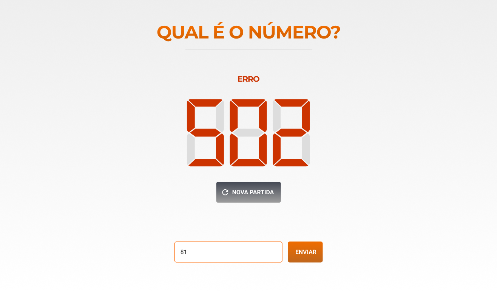

# QUAL É O NÚMERO?

> Desafio proposto que consiste em receber um número através de uma requisição e implementar um jogo para acertar este número através de palpites..

### Ajustes e melhorias

O projeto ainda está em desenvolvimento e as próximas atualizações serão voltadas nas seguintes tarefas:

- [ ] Tarefa 1 - Criar testes unitários
- [ ] Tarefa 2 - Configuração de Bundler
- [X] Tarefa 3 - Hospedar projeto na plataforma Vercel
- [X] Tarefa 4 - Responsividade
- [ ] Tarefa 5 - Criar campo de histórico de jogadas

## 💻 Pré-requisitos

Antes de começar, verifique se você atendeu aos seguintes requisitos:
* Você instalou a versão mais recente do navegador que utiliza.
* Você tem uma máquina `<Windows / Linux / Mac>`.
* Você possui `<VSCode>`.

## Site

Se deseja visualizar o modelo do site em funcionamento <a  href="https://sort-number-check.vercel.app/" target="_blank">clique aqui </a>!

## 🤝 Colaboradores

Pessoas que contribuíram para este projeto:

<table>
  <tr>
    <td align="center">
      <a href="https://github.com/LZagatto" target="_blank">
         
        
          <b>Leonardo Zagatto</b>
        
      </a>
    </td>
  </tr>
</table>

## 😄 Seja um dos contribuidores

Quer fazer parte desse projeto? Clique [AQUI](mailto:leozagatto1@gmail.com) e me envie um email.

[⬆ Voltar ao topo](#Finder-React) 
